# 📱 اپلیکیشن پیام‌رسان هوشمند smsPRO (CuponApp Native Android)

[](https://github.com/kamrankrtm/CuponApp/releases)
[](https://developer.android.com)
[](LICENSE)
[](https://github.com/kamrankrtm/CuponApp)

> **smsPRO (کوپن‌اپ)** یک پیام‌رسان بومی، فوق‌سریع و مدرن برای سیستم‌عامل اندروید است که برای نخستین‌بار پیامک‌های ورودی را با موتور هوش مصنوعی و پردازش زبان طبیعی محلی (On-Device NLP) تجزیه و تحلیل کرده و در ۵ زبانه هوشمند تفکیک می‌کند. با این اپلیکیشن هیچ کد تخفیفی منقضی نمی‌شود، ورود با رمز یکبارمصرف (OTP) بی‌درنگ انجام شده و اسپم‌های تبلیغاتی مزاحم بی‌صدا می‌شوند.

---

## 📸 تصاویر محیط برنامه (Screenshots)

> طراحی جدید smsPRO — مینیمال، هماهنگ در حالت روشن و تیره، با فونت دبی. این تصاویر پیش‌نمایش طراحی هستند و پس از انتشار نسخه نهایی با اسکرین‌شات واقعی از برنامه جایگزین می‌شوند.

<p align="center">
  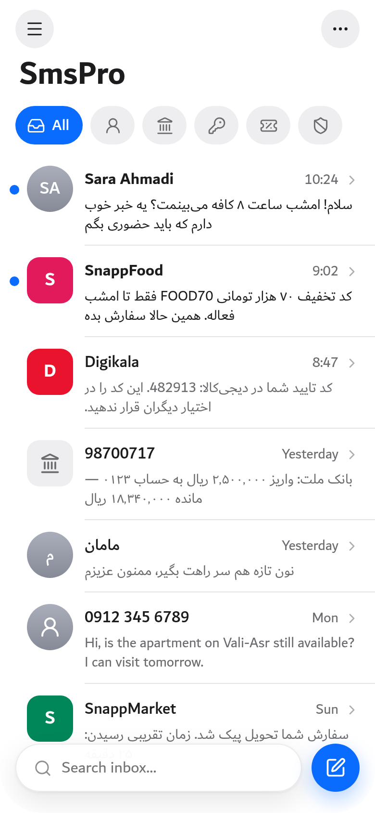
  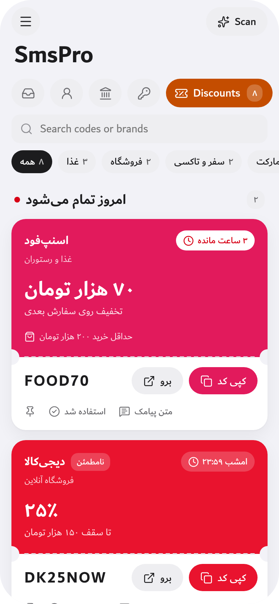
  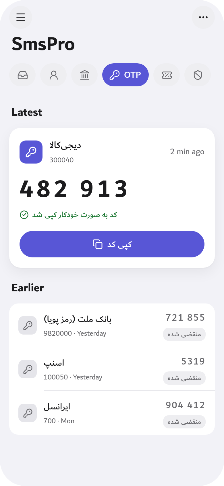
  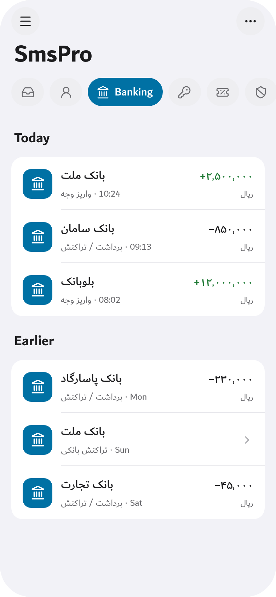
</p>
<p align="center">
  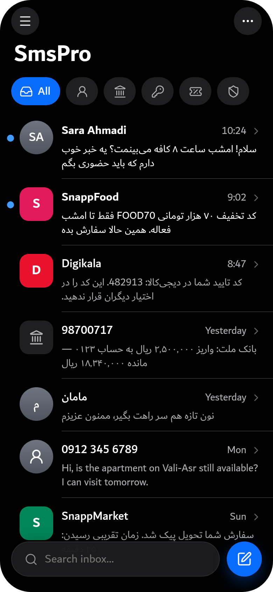
  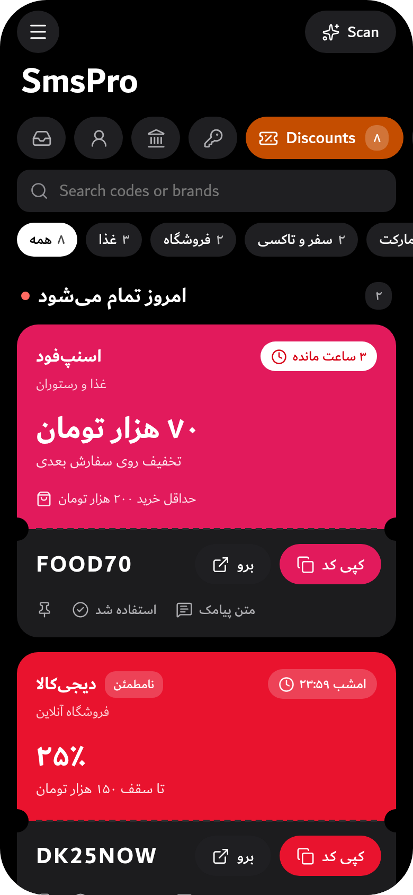
  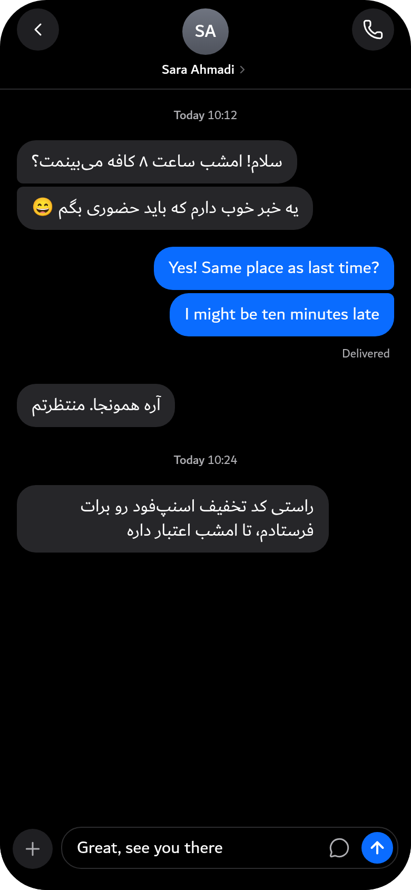
  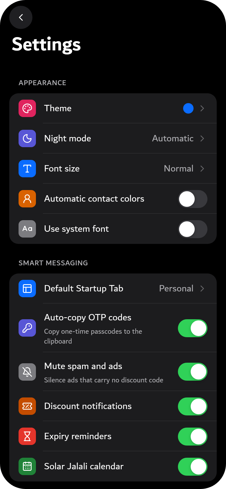
</p>
<p align="center">
  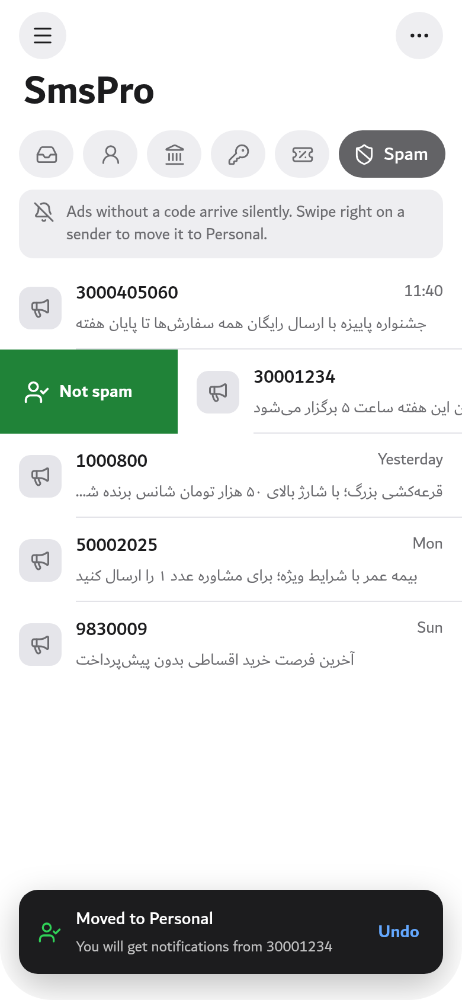
  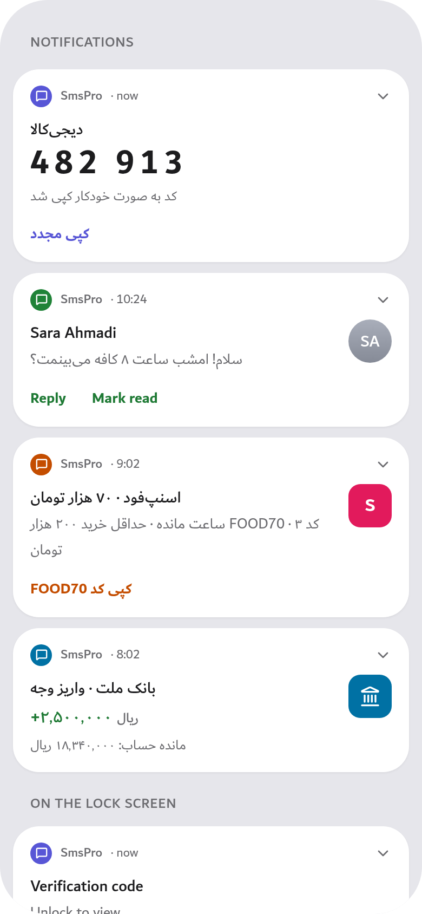
  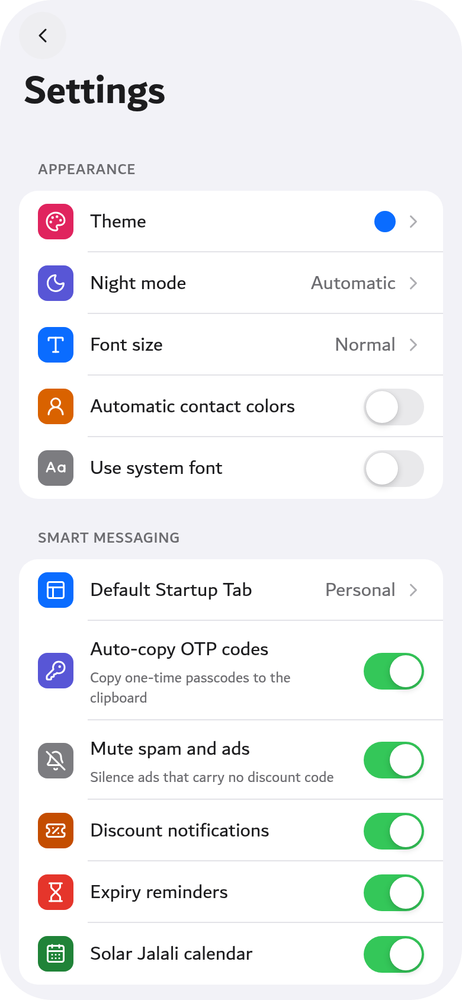
  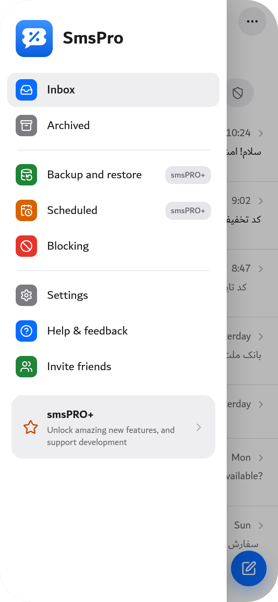
</p>

---

## ✨ قابلیت‌های منحصربه‌فرد smsPRO

### ۱. 🎁 مرکز کدهای تخفیف و جشنواره‌ها (Discounts Hub)
- **استخراج بلادرنگ کدهای تخفیف:** تشخیص خودکار نام برندها (اسنپ‌فود، تپسی‌فود، دیجی‌کالا، فیلیمو، سینماتیکت، اکالا، اسنپ‌اکسپرس، باسلام و...).
- **کارت‌های شکیل و مدرن:** نمایش نام برند، درصد یا مبلغ تخفیف، کد تخفیف با دکمه کپی ۱-کلیکه.
- **راه و شرایط استفاده از تخفیف:** دیالوگ اختصاصی راهنمای گام‌به‌گام نحوه اعمال کد و شرایط حداقل سفارش.
- **تاریخ انقضای هوشمند:** جایگزینی عبارات مبهم نظیر «تا اطلاع ثانوی» با اعتبار پیش‌فرض ۱ ماهه خورشیدی از لحظه دریافت.
- **جستجو و فیلتر موضوعی:** دسته‌بندی ۵گانه غذا و رستوران، فروشگاهی، سوپرمارکت، سفر و حمل‌ونقل، فیلم و سرگرمی به همراه جستجوی لحظه‌ای.

### ۲. 🔑 مرکز کدهای ورود و تایید هویت (Smart OTP)
- **استخراج آنی عدد تایید:** تشخیص ارقام ۴ تا ۸ رقمی رمز یکبارمصرف، رمز پویا و کدهای ورود به همراه نام سرویس.
- **کپی خودکار به کلیپ‌بورد (Auto-Copy):** به محض دریافت پیامک، کد کپی شده و پیام راهنمای فارسی نمایش داده می‌شود.
- **تفکیک کدهای امروز و منقضی‌شده:** کدهای دریافتی امروز پررنگ و فعال، و کدهای روزهای گذشته برای جلوگیری از اشتباه به شکل خودکار کم‌رنگ و با برچسب «(منقضی)» مشخص می‌شوند.

### ۳. 🗂️ تفکیک ۵گانه و هوشمند زبانه‌ها (Smart Tabs)
1. **همه (All):** نمایش تمامی گفتگوها و پیامک‌ها.
2. **شخصی (Personal):** صرفاً شماره‌های شخصی (`09...`) و مخاطبین ذخیره‌شده دفترچه تلفن.
3. **بانکی (Banking):** پیامک‌های تراکنش‌های مالی، واریز، برداشت، مانده حساب و کارت‌های عضو شتاب.
4. **کدهای ورود (OTP):** دسترسی تجمیعی و سریع به آخرین کدهای تایید هویت.
5. **تخفیف‌ها (Discounts):** ویترین کدهای تخفیف استخراج‌شده.
6. **اسپم و تبلیغات (Spam):** پیامک‌های تبلیغاتی انبوه بدون تخفیف که به صورت خودکار بی‌صدا می‌شوند تا مزاحمتی ایجاد نکنند.
   - **«اسپم نیست»:** اگر پیامکی به اشتباه در اسپم قرار گرفت، کافی است آن را به سمت راست بکشید؛ فرستنده به زبانه شخصی منتقل می‌شود و از این به بعد اعلان پیام‌هایش را دریافت می‌کنید (با امکان بازگرداندن).

### ۴. 📅 تقویم خورشیدی و ارقام فارسی (Jalali Calendar)
- تبدیل دقیق ۳۳ ساله میلادی به شمسی بدون نیاز به اینترنت و بدون کتابخانه‌های سنگین خارجی.
- نمایش تاریخ شمسی و ارقام فارسی در تمامی صفحات گفتگو، لیست‌ها و نوتیفیکیشن‌ها.

### ۵. 🤖 پاسخ هوشمند با هوش مصنوعی (AI Smart Reply)
- دکمه اکشن اختصاصی «پاسخ هوشمند» در اعلان پیامک‌ها و پشتیبانی کامل از ساعت‌های هوشمند (Wear OS).
- تحلیل زمینه ۱۰ پیام اخیر و فاصله‌های زمانی گفتگو برای تولید پاسخی طبیعی، مودبانه و مرتبط به زبان فارسی.

### ۶. 💬 ارسال مستقیم در واتس‌اپ (WhatsApp Direct Send)
- آیکون شکیل واتس‌اپ در صفحه چت برای باز کردن فوری صفحه گفتگو در واتس‌اپ بدون نیاز به ذخیره کردن شماره مخاطب.

### ۷. ☁️ موتور ابری جایگزین MMS
- تبدیل خودکار عکس‌ها و ویدیوها به لینک دانلود در سرور ابری [Files.ir](https://my.files.ir) و کوتاه‌سازی خودکار لینک با API اختصاصی زایا ([zaya.io](https://zaya.io)) جهت ارسال رایگان و بدون دردسر در بستر پیامک معمولی.

### ۸. 🚀 بررسی خودکار و درون‌برنامه‌ای آپدیت (Auto Update Checker)
- بررسی منظم آخرین نسخه منتشرشده در صفحه GitHub Releases و نمایش دیالوگ به‌روزرسانی همراه با لیست تغییرات و لینک مستقیم دانلود.

---

## 📥 دانلود و نصب آخرین نسخه (Download APK)

جدیدترین فایل نصبی برنامه را می‌توانید همواره از بخش [Releases](https://github.com/kamrankrtm/CuponApp/releases) دریافت کنید:

| نسخه | نام فایل | معماری | وضعیت بیلد | لینک دانلود |
| :--- | :--- | :--- | :--- | :--- |
| **v2.0.1** | `smsPRO-2.0.1.apk` | Universal (همه پردازنده‌ها) |  | [دانلود نسخه ۲.۰.۱](https://github.com/kamrankrtm/CuponApp/releases/latest) |

---

## 🛠️ ساخت و کامپایل پروژه (Build from Source)

این پروژه با Gradle و پلتفرم کاملاً بومی اندروید توسعه یافته است:

```bash
# کلون کردن رپازیتوری
git clone https://github.com/kamrankrtm/CuponApp.git
cd CuponApp

# اجرای بیلد نسخه Debug بدون نیاز به آنالیتیکس
./gradlew assembleNoAnalyticsDebug
```

فایل نصبی تولیدشده در مسیر زیر قرار خواهد گرفت:
```
presentation/build/outputs/apk/noAnalytics/debug/presentation-noAnalytics-debug.apk
```

---

## ☕ حمایت از توسعه برنامه (Donate & Support)

smsPRO یک پروژه **متن‌باز و رایگان** است. چنانچه این برنامه برای شما کاربردی و مفید بوده است، می‌توانید با روش‌های زیر از توسعه ادامه‌دار آن حمایت کنید:

1. ⭐ **ستاره دادن به مخزن گیت‌هاب:** با زدن دکمه Star در بالای همین صفحه، به دیده‌شدن بیشتر پروژه کمک کنید.
2. 💳 **حمایت مالی درون ایران:** 
   - حمایت از طریق پلتفرم [ری‌میت (Reymit)](https://reymit.ir) یا درگاه شخصی [زرین‌پال (ZarinPal)](https://zarinpal.com).
   - برای دریافت شماره کارت یا لینک حمایت مالی می‌توانید از طریق ایمیل توسعه‌دهنده در ارتباط باشید.

---

## 👤 توسعه‌دهنده (Developer)

- **کامران کراماتیان (Kamran Keramatian)**
- گیت‌هاب: [@kamrankrtm](https://github.com/kamrankrtm)
- ایمیل پشتیبانی: `k.keramatian@gmail.com`

---

## 📄 لایسنس (License)

این نرم‌افزار تحت مجوز **GNU General Public License v3.0 (GPLv3)** منتشر شده است. اطلاعات بیشتر در فایل [LICENSE](LICENSE) در دسترس است.
